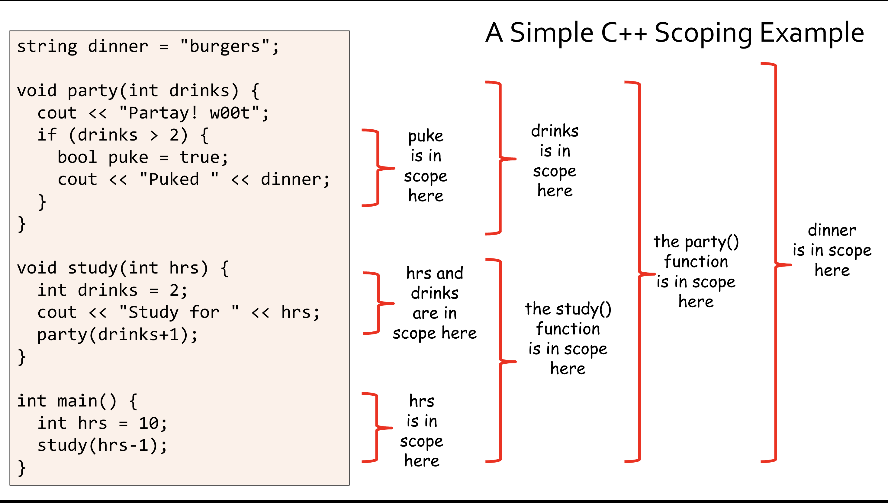
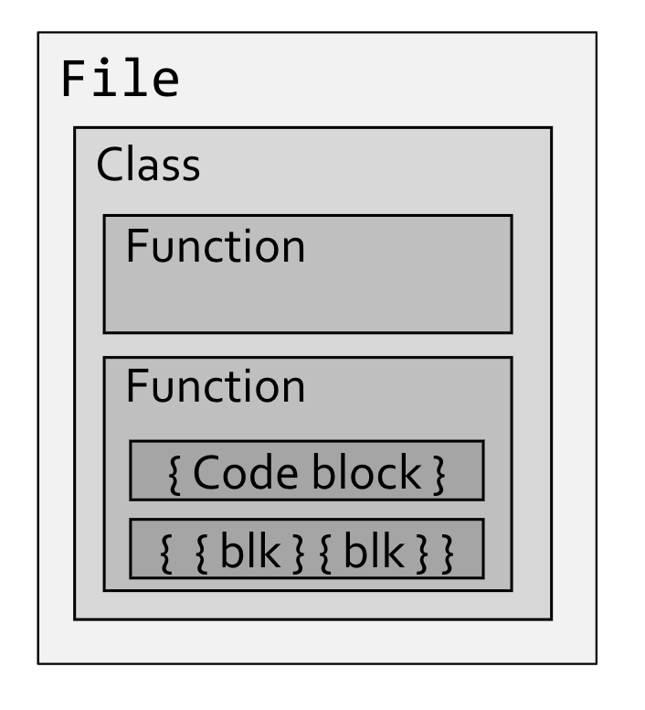
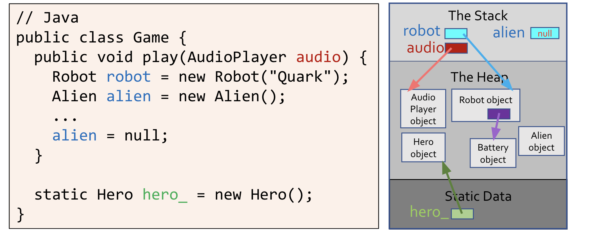
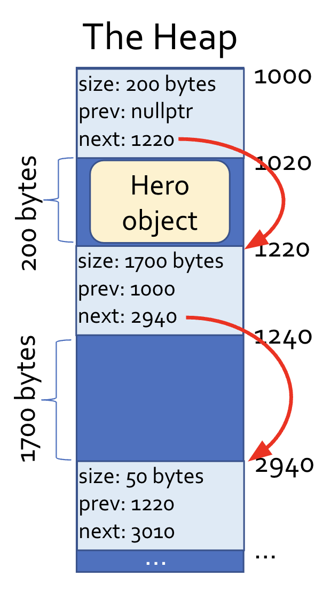
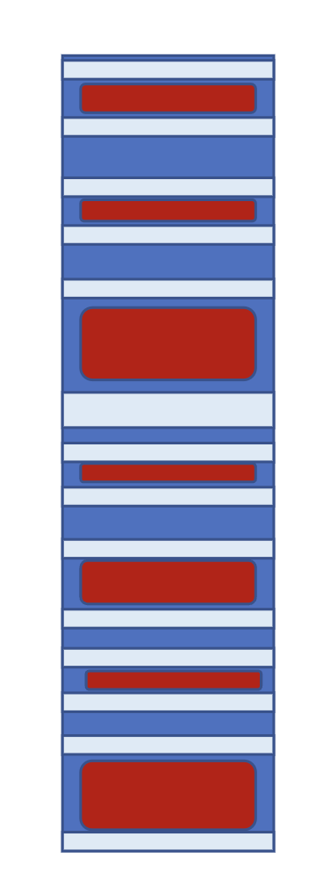
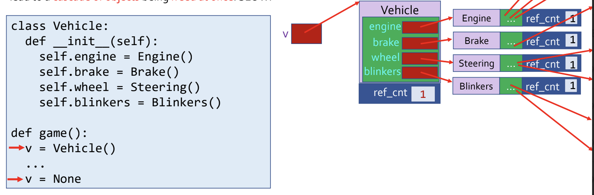

# Data Palooza
## Variables
- A variable is a *symbolic name* that is associated with a storage location, containing either a *value* or a *pointer to a value*
  - A value is a *piece of data* that is either referred to by a variable or computed by a program expression
    - Values *can be pointers*, which themselves refer to *values*
  - E.g. `a: 3.14159` associates the variable with a value whereas `a: ADDR -> 3.14159` associates the variable with a *pointer to a value*
- Facets associated with a variable: *name*, *type*, *value*, *binding*, *storage*, *lifetime* (timeframe over which a variable exists, consider garbage collection), *scope* (when and where the variable name is *visible to the code*), *mutability*
  - For values, we care about its *type*, *value*, *storage*, *lifetime*, and its *mutability*
## Types
- A **type** is a classification used to identify a category of data, defining a *range of values*, *size and encoding*, *operations*, *usage context* (e.g. to functions), and *ways to convert or cast*
- Not all variables in languages have a *type* - if a variable is *bound to a single value*, then it has a type, but otherwise it could be bound to values of differing types over its lifetime (`x = 5` and then later on `x = "bletch"`)
  - Values, however, always have an associated type
- Types of Types:
  - **Primitives**: Integers, Floats, Chars, Enums, Bools, Pointers
  - **Composites**: Unions, Classes, String, Tuples, Structs, Containers
  - Others: Functions, Generics (e.g. Templates), Boxed Type (wrap around a primitive, allowing for them to be mutated)
- Beyond the built-in types provided by languages, it is often possible for users to *define new types* 
  - Every time a class is created, the language *implicitly defines a type* associated with that class
    - This also applies to structs, enums, and interfaces (in general)
  - Example:
    -     class Circle {
            public:
              ...
            private:
              ...
          }
    - This implicitly defines a new type `Circle`
- Many types have a **supertype-subtype** relationship, where a *subtype inherits properties and behaviors from its supertype*
  - A key example of this is with *class inheritance*
    -     class Person {
            public:
              virtual void eat()
                { cout << "Nom Nom"; }
              virtual void sleep()
                { cout << "Zzzzzzz"; }
          }
          class Nerd: public Person {
            public:
              virtual void study()
                { cout << "Studying..."; }
          }
    - This implictly defines types for *Nerd* and *Person*, and *Nerd* is a subtype of *Person*
  - **Interfaces** can also support this relationship, where we say a class *implements an interface*
    - Recall that interfaces are generally *abstract*
    - Example: `Car implements Washable`, so Car is a subtype of Washable
  - Since each type is associated with a specific set of operations, when a subtype is defined it also inherits *all operations of its supertype*
    - There is an operational relationship here, and this can be used to determine operational compatibility between types to support things like *type casting* and *polymorphism*
    - Example:
      -     class Person
              ...
            class Nerd : public Person
              ...
            void bePersoney(Person &p)
              ...

            Nerd nancy;
            bePersoney(nancy);
      - Even though `nancy` is a `Nerd`, it can still be passed into the `bePersoney` method because `Nerd` inherit all functions supported by a `Person`
- **Value types** are types that can be used to instantiate *objects or values* (and define pointers, objects, and references)
  - On the other hand, **reference types** are types that *cannot be used to instantiate objects or values*, but rather can only be used to define *pointers, objects, or references*
    - An example of this is with *abstract classes*
  - Example:
    -     class Dog {
            public:
              Dog(string n) { name = n; }
              void bark() { cout << "Woof"; }
            private:
              string name_;
          }

          class Shape {
            public: 
              Shape(Color c) { color_c = c; }
              virtual double area() = 0;
            private:
              Color color_;
          }

          // This is a value type
          Dog d("Kuma"), *p;

          // This is a reference type; we cannot insantiate a Shape object
          // because it is not implemented (it is abstract), so all we can do 
          // is declare a pointer
          Shape *s;
- **Type equivalence** is the criteria by which programming languages determine whether two values or variables are of equivalent types
  - One approach is to use **name equivalence**, which denotes equivalence if two variables / values have identical type names
      -     struct S { string a; int b; };
            struct T { string a; int b; };

            int main() {
              S s1, s2;
              T t1, t2;
              s1 = s2; // Works
              s1 = t1; // Fails, despite equivalent structure due to name equivalence
            }
      - This is typical to statically typed languages
  - Another approach is **structural equivalence**, which denotes equivalence if structures are identical, regardless of type names
      -     type S = { a: string, b: number };
            type T = { a: string, b: number };

            function main() {
              let s1, s2 : S;
              let t1, t2 : T;
              s1 = s2; // Works
              s1 = t1; // Works
            }
      - This is typical of dynamically typed languages
- Type Checking:
  - Strictness:
    - **Strong Type Checking**: The language's typing system *guarantees* that all operations are only invoked on objects/values of appropriate types
      - This ensures that there will *never be undefined behavior at runtime due to type-related issues*
      - For a language to be strongly typed, it must be **type-safe**, meaning it will prevent an operation on variable *x* if *x*'s type does not support that operation, and it must be **memory-safe**, meaning that inappropriate memory accesses are prevented
        - Memory safety is needed for strong typing because invalid memory accesses can result in types being accessed as if they were a *different type*
          -     int arr[3] = {10, 20, 30};
                float salary = 120000.50;
                // Because of how variables are stored on the stack, this will access the float like it is an int
                cout << arr[3];
      - To implement strong typing:
        - Before an expression is evaluated, the compiler or interpreter *validates* that all of the operands used in the expression have compatible types
          -     y = Dog("Koda")
                x = 5 + y // Error
        - All conversions and casts between different types are checked and if the types are incompatible, some sort of error is generated
          -     y = Dog("Koda")
                x = (int)y // Error
        - Pointers are either set to null or assigned to point at a valid object at creation
          -     Dog *x
                print(x) // Error
        - Accesses to arrays are bound checked
          -     int x[5]
                print(x[100]) // Error
        - The language ensures that objects cannot be used after they are destroyed 
          -     delete d;
                d->bark(); // Error
      - In a strongly typed language, a type cast is *checked* (typically at runtime, at the time of the cast) and throw an error if the cast is illegal
        - `C++` is *not strongly typed*, and so it is possible to perform unsafe casts - that is, casts that will succeed with incompatible types
      - Strongly typed languages are preferred because they reduce software vulnerabilities and can allow for early detection of bugs
        - However, strongly typed languages are *slower* compared to weakly typed languages due to the need to check for safety
    - **Weak Type Cheecking**: The language's type system does *not guarantee* that all operations are invoked on objects/values of appropriate types
      - Weakly typed languages are *not type safe* and are *not memory safe*
      - There are can be *undefined behavior at runtime* since errors are not generated upon illegal operations
        - This usually means that the behavior is *non-deterministic*, though if behavior is *deterministic* (e.g. ran one million times and had the same result each time) for illegal operations then it is not necessarily weakly typed
        - *Implicit behavior* is not indicative of weak typing (e.g. implicit cast of `"cat"` to `0` and `"90"` to `90` when doing `10 + "90" + "cat"`)
  - Compile-Time (or before running) versus Runtime:
    - **Static Typing**: Prior to execution, the type checker determines the type of every expression and ensures all operations are compatible with the types of their operands
      - Some statically typed languages have explicit type annotations - e.g. `C++`: `int add(int a, int b) {return a + b; }`
      - Other statically typed languages *do not have explicit type annotations*: - e.g. `Haskell`: `abs a = if a > 0 then a else (-a)`
        - Here, there is *type inference*, as it can be inferred that `a` is numeric due to the comparison with `0`, and then it can also infer that the return type is also numeric since the `abs` function returns a numeric type
        - Type inference is never completely simple, as there can be ambiguity (e.g. `x + 5` could have `x` inferred as either an `int` *or* a `double`), and so it may be necessary to look at the *entire program*
      - If the type checker cannot assign distinct types to all variables, functions, and so forth, then it generates a *compiler error*
        - If the program type checks, though, it means the code is mostly safe (though there still might be checks done at runtime)
      - To support static typing, languages *must have a fixed type bound to each variable at definition*; once a variable's type is assigned, it cannot be changed
        - Example: Consider Python, which is *not statically typed*
          -     def foo(x):
                  if x > 5:
                    a = 10
                  else:
                    a = "cats"
          - There is no way a compiler could figure out the type of *variable a* when *compiling* this code
      - In statically typed languages, there may still be a need to check *some* types at runtime. This is typically the case when *downcasting* is performed (cast superclass down to a subclass)
        -     class Person { ... };
              class Student : public Person { ... };
              class Doctor : public Person { ... };
              void partay (Person &p) {
                // Assumes only students go to parties 
                Student &s = dynamic_cast<Student &>(p);
                s.getDrunkAtParty();
              }

              int main() {
                Doctor d("Dr Fauci"); 
                // This will be compiled, but at runtime this will cause an error
                partay(d);
              }
        - The downcast *must be checked at runtime* because there is no way to know at runtime, in general, whether or not the Person being passed in can actually be downcasted as a student
      - Static typing checking is *conservative* - it is entirely possible for static type checking to prevent technically correct programs from compiling because the type checker is overly conservative
        -     void handlePet(Mammal& m) {
                m.makeNoise(); // Defined for all mammals
                if (m.name() == "Spot")
                  m.bite(); // Defined only for dogs, not cats
                else (m.name() == "Meowmer")
                  m.scratch(); // Defined only for cats, not for dogs
              }
              int main() {
                Dog d("Spot");
                Cat c("Meowmer");
                handlePet(d);
                handlePet(c);
              }
          - Although this code would work, it *does not compile* because the type checker is conservative
      - Static typing can be beneficial because it produces faster code (fewer runtime checks), detects bugs earlier in development, and does not require custom code to check types
        - As downsides, though, static typing may result in longer compilation and also may not allow perfectly correct code to compile due to the conservative nature of the type checker
    - **Dynamic Typing**: As the program executes (so at *runtime*), the type checker ensures that each primitive operation is invoked with values of the right types
      - During runtime, if an illegal operation occurs on a value, then an exception is generated or the program crashes
        -     def add(x, y):
                print(x + y)
              def foo():
                a = 10
                b = "cooties"
                add(a, b) # This will cause an error during runtime
      - Typically, types are *not assigned to variables* (e.g. Python variables do not have a fixed type, and so they can refer to various types of values over their lifetime)
        - For this reason, types are typically associated with *values* but not the *variables holding them* 
      - Dynamically typed languages perform type checking by storing a *type tag* along with every value, and this information is used to check all operations
        -     a = 10
              b = "nerd"
              a + b 
          - `a` refers to something along the lines of `type: int, value: 10`
          - `b` refers to something along the lines of `type: string, string: "nerd"`
          - When the add is performed, the type tags of the values stored by each variable are checked, and since they are not compatible with the addition operator an error is raised
      - It is typically necessary in these languages to perform **type introspection** in code to check types *explicitly*
        - E.g. `if type(v) == "string" then...`
      - Dynamically typed languages can still have *type annotations*, which require that certain variables (e.g. parameters) must hold a certain type 
        - This does not restrict the variable because variables do not have types - rather it restricts the type of the value held by the variable
        - E.g. `print_n(v, n::Int)`
          - When a variable is passed in for `n`, the value that the variable is referring to (so referencing the pointer or object reference) is checked to see if the type is of an `Int`
      - A consequence of dynamic typing is *duck typing*: at runtime, the program checks the suitability for an operation based on the presence of *required methods* rather than the object's type
        - Because of this, **dynamically typed languages do not involve explicit casting**
        -     class PersonInDuckSuit:
                def quack(self): print('Hi! Uh...I mean quack!')
              class Duck:
                def quack(self): print('Quack quack quack!')
              class Vehicle:
                def drive(self): print('Vroom')
              
              def quack_please(x):
                x.quack()

              p = PersonInDuckSuit()
              d = Duck()
              v = Vehicle()

              quack_please(p) # Works 
              quack_please(d) # Works 
              quack_please(v) # Raises an error
        - Python's Duck Typing allows for classes to support certain interfaces by simply defining methids:
          - `__iter__` and `__next__` allows for a class to be iterable 
            -     class Cubes:
                    def __init__(self, lower, upper):
                      self.upper = upper
                      self.n = lower 
                    def __iter__(self):
                      return self
                    def __next__(self):
                      if self.n < self.upper:
                        s = self.n ** 3
                        self.n += 1
                        return s 
                      else:
                        raise StopIteration

                    for i in Cubes(1, 4):
                      print(i)

          - `__str__` allows for any class to be printable
          - `__eq__` allows for any class to be comparable
        - Duck typing allows for more flexibility, simpler code, faster prototyping, but is slower and more unsafe
    - **Gradual Typing**: One can *choose* whether to specify a type for variables or parameters
      - If a variable is untyped, then type errors for that variable are *only detected during runtime*, but if a variable is typed then *some type errors can be detected at compile time*
        - If an *untyped variable* is passed to a *typed variable* (like in a function), then the code would still compile but there would be a *runtime check*
          -     def square(x : int):
                  return x * x
                def what_happens(y):
                  print(square(y))
      - Gradually typed languages use *type tags* (for runtime checks) and *variable types* (for compilation checks)
## Type Conversions and Casting
- There is a difference between a **type conversion** and a **type cast**
  - A **type conversion** takes a value of type *A* and generates a *new value* of type *B*
    -     int main() {
            float pi = 3.141;
            // This is a conversion, because the bit representations are different (floating point versus int)
            cout << (int) pi; 
          }
    - Type conversions are typically used to convert between *primitives*
  - A **type cast** takes a value of type *A* and *views it as if it were a value of type B* - no new value is created
    -     class Person { ... };
          class Student : public Person { ... };
          int main() {
            Student mary;
            ...
            Person &p = (Person &)mary;
            cout << "Hi " << p.name();
          }
      - When the cast is performed, the attributes of `mary` that correspond to a `Person` object can be accessed, but while `mary` is cast as a person, the attributes corresponding only to a `Student` cannot be accessed
    -     int main() {
            int val = -42;
            // Views val as an unsigned int and prints out 4294967254
            cout << (unsigned int) val;
          }
      - This is an example of casting without classes
    - Type casts are typically used with *objects*
- Conversions and casts can either be *explicit* or *implicit*
  - Explicit Conversion:
    -     void foo(int i) { ... }
          int main() {
            float f = 3.14;
            foo((int)f);
          }
    - In C++, explicit type conversion can be done also using `static_cast` - e.g. `static_cast<int>(fpi)`
    - In Python: `int(fpi)`
  - Explicit Cast:
    -     void feed_young(Animal *a) {
            if (a->has_fur()) {
              ((Mammal *)a)->produce_milk();
            }
          }
    - In C++, explicit casts can also be done using `dynamic_cast` - e.g. `dynamic_cast<Student*>(p)`
      - This will return a `nullptr` if the cast fails
  - Implicit Conversion (aka coercion):
    -     void foo(float f) { ... }
          int main() {
            int i = 42;
            foo(i);  
          }
  - Implicit Cast:
    -     void use_potty(Person *p) { p->poop(); }
          int main() {
            Nerd *n = new Nerd("paul");
            use_potty(n);
          }
    - Most implicit casts are *upcasts*, meaning they go from a subclass to a superclass
      - *Downcasts* are usually explicit because they are not always valid
- Whenever an explicit conversion or cast is performed, what would otherwise be a compile time error check turns into a *runtime error check*
  - Example:
    -     class Person { ... }
          class Student extends Person { ... }
          class Professor extends Person { ... }

          class Example {
            public void do_your_thing(Professor q) {
              q.give_a_lecture();
            }

            public void process_person(Person p) {
              if (p.get_name() == "Carey")
                // This would not be allowed because p is a Person and may not necessarily be 
                // a Professor, resulting in a compile-time error
                
                // do_your_thing(p);

                // This would now compile, but there would still be a runtime check (if strongly typed)
                // that would throw an error if the cast is invalid
                do_your_thing((Professor) p);
            }
          }
- Most languages have a prioritized set of rules that govern implicit *conversions* (**coercions**)
  - A coercion that converts a *narrow type* into a *wider type* is called a **type promotion**
    - Example: Converting from an `int` to a `double`
  - Example: C++'s rules (from top to bottom)
    - If either operand is `long double` then convert the other to `long double`
    - If either operand is `double` convert the other to `double`
    - If either operand is `float` then convert the other to `float`
    - ...
- In a *strongly typed language*, every conversion or cast with potential for an issue is checked for validity at runtime
  - In a *weakly typed language*, some invalid conversions or casts may not be checked at runtime
    - There can still be checked casts, such as `dynamic_cast` in C++
## Scoping
- Every language has **scoping rules**, which govern the visibility of variables in a program
  - A variable is *in-scope* if it can be explicitly accessed by its name in that region
- Formally, the **scope** of a variable is the range of a program's instructions where the variable is known. A variable is *in-scope* if it can be accessed by name in a particular part of a program. A variable in scope has an **active binding**
- The set of in-scope variables and functions at a particular point in a program is called its **lexical environment**
  - Example:
    - 
    - The lexical environment when doing `cout << "Puked"` is: `party()`, `dinner: "burgers"`, `drinks: 3`, `puke: 3`
- A variable can be alive but not be in scope. The **lifetime** (creation to destruction) of a variable may include times when the variable is in scope and also times when it is not in scope
  - Example:
    -     void study(int how_long) {
            while (how_long-- > 0)
              cout << "Study!\n";
            cout << "Partay!\n";
          }

          int main() {
            int hrs = 10;
            study(hrs);
            cout << "I studied " << hrs << " hours!";
          }
    - The `hrs` variable has a lifetime that lasts from the start of `main` to the end, but it is not in scope when `study` is called
  - Some programming languages like Python allow you to explicitly control the lifetime of a variable
    -     def main():
            var = "I exist"
            ...
            del var
            print(var) # Error thrown
    - This is not the same as controlling the lifetime of the *value* - this is just deleting the variable
  - Values have lifetimes and this is often *independent* from the lifetime of variables
    - Example:
      -     class Dingleberry:
              ...
            def make_dingle():
              d = Dingleberry()
              return d

            x = make_dingle()
            if x.is_clinging()
              print("Wipey wipey")
        - The variable `d`'s lifetime ends after the `make_dingle` function, but its value still is alive even after
- **Lexical scoping** is the most dominant scoping approach. Here, all programs are comrpised of a series of nested *contexts* (e.g. files, classes in those files, functions in those classes, blocks in those functions, etc.)
  - All variables that are in scope at a position X in code are determined by looking at X's context first, then looking in successively larger enclosing contexts around X
  - Example:
    -     string a_secret = "Nerds are sexy!";

          class Nerd {
            public:
            ...
            void pick_nose(int count) {
              int j;
              for (j = 0; j < count; ++j)
                // Here, everything in scope is: j, count, name, and a_secret
                cout << name << " digs in!\n";
            }

            private:
              string name;
          };
  - Python does `LEGB` rules for lexical scoping: first local, then enclosing, then global, and finally built-in 
    - Example:
      -     host = 'cindy'
            def party():
              guest = 'chen'
              def use_hot_tub():
                drink = 'white claw'
                # print is discovered from built-in
                print(host, 'and', guest, 'are tubbin') # guest is discovered from enclosing, host is discovered from global
                print('and drinking', drink) # drink is discovered from local
  - The contexts that can be considered here are *expressions*, *blocks*, *functions*, *classes*, *structs*, *namespaces*, and *global*
  - 
    - Each scope can only access *higher scopes*, it cannot access scopes at the same level (so a function cannot access the scope of another function even if the parent function calls it)
- In **dynamic scoping**, when you reference a variable, the program tries to find it in the current block and its enclosing blocks
  - If the variable cannot be found, the program then searches the calling function for the variable, and if that cannot be found then it continues to check that function's calling function and so forth
  - Dynamic scoping is dead because it is unintuitive compared to lexical scoping - to understand dynamic scoping, once must know the order of function calls to figure out scoping whereas with lexical scoping it is possible to figure out the scoping just from the structure of the code itself
  - Example:
    -     func foo() {
            y++;
            print x, y
          }

          func bar() {
            int y = 32;
            foo();
          }

          func bletch() {
            int x = -1, y = 5;
            foo();
          }

          func main() {
            int x = 1000;
            // With this call:
            // Call to bar() -> x: 1000, y: 32
            // bar calls foo() -> x: 1000, y: 33, so 1000 and 33 is printed
            // After all the functions end, the variables die
            bar();
            // Call to bletch() -> x: -1, y: 5
            // Call to foo() -> x: -1, y: 6, so -1 and 6 is printed
            bletch();
          }
## Memory Safety
- Memory-safe languages *prevent memory operations that could lead to undefined behaviors*
  - Many bugs and hacking vulnerabilities are due to memory unsafety
  - Example:
    -     int[] array = new int[20];
          int i = 400;
          System.out.println(array[i]) // Java will throw an exception here
- Memory *unsafe* languages allow: 
  - *Out-of-bound array indexes and unconstrained pointer arithmetic*
    - Example:
      -     int arr[10], *ptr = arr;
            arr[-1] = 42; // Out of bounds
            cout << *(ptr + 100); // Bad pointer arithmetic
    - Memory safe languages will throw an exception for out of bounds access or disallow pointer arithmetic altogether
  - *Casting of values to incompatible types*
    - Example: 
      -     int v;
            Student *s = dynamic_cast<Student *>(&v);
            s->study();
    - Memory safe languages throw an exception or generates a compiler error for invalid casts
  - *Use of uninitialized variables or pointers*
    - Example:
      -     int val, *ptr; // Both uninitialized
            cout << val; // Could leak info
            *ptr = -10; // Corrupts memory
    - Memory safe languages throw an exception or generate a compiler error, or even hide pointers altogether (e.g. Python)
  - *Use of dangling pointers*
    - Example:
      -     Student *s = new Student("Gerome");
            delete s; // Student is no longer valid
            s->study(); // Undefined behavior
    - Memory safe languages prohibit programmer-controlled object destruction or ensure that objects are only destroyed when *all references to them disappear*
- Preventing memory leaks is *not necessarily a criteria for memory safety*, because this does not result in undefined behavior - the program is still deterministic
  - Languages with garbage collection are still capable of running out of memory
### Garbage Collection
- In **garbage collected** languages, the language manages all memory allocation and de-allocation automatically
  - Memory that has been allocated but is *no longer referenced* is garbage collected
  - This eliminates *most* memory leaks, eliminates dangling pointers and use of dead objects, eliminates double-free bugs, and eliminates manual memory management
- As a good rule of thumb, garbage collection occurs for an object when there are no longer any references to that object
  - No *local variables*, no *member variables*, no *global variables*
  - Example:
    -     public void do_some_work() {
            Nerd nerd = new Nerd("Jen");
          } // nerd's memory is a candidate for garbage collection
    -     public void do_some_work() {
            Nerd nerd = new Nerd("Jen");

            nerd = new Nerd("Rick"); // Old nerd is candidate for garbage collection
          }
#### Mark and Sweep
- This is an example of *bulk garbage collection*, which will typically only occur when memory runs low (so the program freezes execution)
- During the **mark phase**, the algorithm identifies all objects that are *still referred to* and thus are considered in-use
  - An object is in-use if it is one of a key set of *root objects*, which may include global variables, local variables across all stack frames, and parameters on the *call stack*
  - An object is also in-use if it is transitively *reachable* via a root object - like from following pointers or references from a root object
    - 
  - Pseudocode:
    -     def mark():
            roots = get_all_roots_objs()
            candidates = new Queue()
            for each obj_ref in roots:
              candidates.enqueue(obj_ref)
              mark_as_in_use(obj_ref)
            
            while not candidates.empty():
              c = candidates.dequeue()
              for r in get_obj_refs_in_object(c):
                if not is_marked(r):
                  mark_as_in_use(r)
                  candidates.enqueue(r)
- During the **sweep phase**, the algorithm scans all heap memory from start to finish and frees all blocks not marked as being 'in-use'
  - Each block in the heap holds a single object / value / array, and also has an *in-use flag*
  - Recall that heap objects have a *header* denoting its size, previous object address, and next object address, and so it can be traversed (like a linked-list), freeing all objects with the in-use flag not set
    - Freeing memory requires changing the `next` and `prev` pointers, as well as coalescing adjacent free blocks together
    - 
  - Pseudocode:
    -     def sweep():
            p = pointer_to_first_block_in_heap()
            end = end_of_heap()
            while p < end:
              if is_object_in_block_in_use(p):
                reset_in_use(p)
              else:
                free(p)
              p = p.next
- An issue with the mark and sweep approach is **memory fragmentation**, which make it very slow or even impossible to find free chunks of memory big enough to accomodate new object allocations
  - 
  - No more coalescing can be done here
#### Mark and Compact
- In **mark and compact**, there is no sweeping phase but rather a *compacting phase*, where all marked objects are compacted to a new *contiguous* block of memory
  - By doing this, though, all existing pointers are now *wrong* so they must adjusted to the proper relocated address
- Mark and compact is an expensive operation, but it prevents fragmentation
- This also limits memory to *half of available memory*, since the other half must be reserved for compacting
  - One half is free, the other half has the allocated objects, and this goes back and forth 
- With both mark and sweep and mark and compact, it is impossible to predict when (and if) a given object will actually be freed by the collector - collection only occurs if there is memory pressure
  - Since it is not known exactly when an object is garbage collected, there can be issues if those objects are hogging resources (other than memory) despite them being candidates for being garbage collected
    - Example: If each object creates a large temporary file that is deleted upon destruction, and a device has a large amount of RAM, then the collector will likely not run and get rid of these temporary files
    - This requires programmers to free resources manually rather than rely on garbage collectors
#### Reference Counting
- This is not a bulk method, but occurs continuously
- Every object has a hidden count that tracks *how many references there are to it*
  - Example:
    -     def foo():
            # The value associated with x (aka the string) has 1 reference now
            x = "I love dogs"
            # Reference count increments to now be 2
            y = x 

            # Decrements reference count, so it is now 1
            # Technically, there is now a reference count of 1 also for the 'None' object
            x = None

            # Going out of scope, the reference count for each is now decremented
- When an object is destroyed (its reference count hits zero), *all* objects transitively referenced by that object must also have their reference counts decreased
  - 
    - When `v` goes away, its reference count goes to zero but then all transitive references (`engine`, `brake`, `wheel`, `blinkers`) also each decrease their reference count
  - This can imply that *many* reference counts can be decremented (cascading) on just a single object disappearing
    - This can, however, be ammortized by keeping a queue of pending references to be deleted and then deleting in batch (e.g. 100 references deleted at a time) rather than doing a full cascade
- An issue with referencing counting is that it fails with *cyclical references*
  - If `a` points to `b` and `b` points to `a`, then the reference count of `a` and `b` will never go to zero
  - Other techniques will need to be used in this case
- Referencing counting still suffers from fragmentation, since freed memory is not compacted
  - There is also a downside in that we may need to reserve extra memory for the reference counts per each object
### Ownership Model
- An alternative to garbage collection is the **ownership model**, which is followed by Rust and C++ (with their smart pointers)
  - The ownership model is done at *compile-time*, so there is no downsides of garbage collection (which happens during runtime)
- In the ownership model, every object is "owned" by one or more variables. When the last owner variable's lifetime ends, the object it owns is freed automatically
  - In some implementations, ownership can be transferred to a new variable, invalidating the old variable
    -     var s1 = new String("I'm owned")
          var s2 = s1 // Transfers ownership to s2 and invalidates s1
          print(s1) // Error
- In Rust's ownership model, every object is owned by a *single variable* in the program
  - Example:
    -     fn foo(s3: String) {
            println!("{}", s3);
          }

          fn main() {
            let s1 = String::from("I'm owned!!");
            let s2 = s1; // Ownership is transferred to s2
            // println!("{}", s1); // Compiler error

            foo(s2); // Ownership is transferred from s2 to s3
            // Because after foo(), the lifetime of s3 (which is the owner)
            // ends, the memory is freed automatically
            // println!("{}", s2); // Compiler error
          }
  - Rust supports *borrowing*, where a variable may refer to an object without taking ownership
    - The borrower may request *exclusive* read/write access (for thread safety) or *non-exclusive* read/write access
    - Example:
      -     fn foo(s3: String) {
              println!("{}", s3);
            }

            fn main() {
              let s1 = String::from("I'm owned!!");
              let s2 = s1; // Ownership is transferred to s2

              foo(&s2); // Borrowing
              println!("{}", s2);
            }
- In C++, a **smart pointer** works like a traditional pointer but also provides automatic memory management
  - Each smart pointer holds a traditional pointer that refers to a dynamically allocated object or array, and is the *owner* of its assigned heap-allocated object
    - It is responsible for freeing its memory when no longer needed
  - When copies are made of a smart pointer, they coordinate and keep track of how many of them refer to the shared resource
  - `std::unique_ptr` is a smart pointer that *exclusively* owns the responsibility for freeing a heap allocated object (typically when it goes out of scope)
    -     #include<memory>
          #include "nerd.h"
          int main() {
            std::unique_ptr<Nerd> p = std::make_unique<Nerd>("Carey", 100);
            p->study(); // p acts like a regular pointer
          } // As soon as p goes out of scope, since it is a local variable its destructor is called and it will automatically free the memory
    - Copies cannot be made of unique_pointers
      - This implies that it cannot be stored in data structures (since this would make a copy of the pointer)
  - `std::shared_pointer` is a smart pointer that *shares* the responsibility for freeing a heap allocated object
    -     #include<memory>
          #include "nerd.h"
          std::vector<std::shared_ptr<Nerd>> all_my_nerds;
          void keep_track_of_nerd(std::shared_ptr<Nerd> n) {
            // Pushing back the pointer itself now adds another reference, so the total count here is 3
            all_my_nerds.push_back(n);
          } // When this ends, the parameter n goes out of scope the count decrements to be 2

          int main() {
            // The object has one reference count 
            std::shared_ptr<Nerd> p = std::make_shared<Nerd>("Carey", 100);
            // Calling the method makes a copy of the pointer, so there is another shared pointer and now the reference count increases by one (to a total of 2)
            keep_track_of_nerd(p);
          } // P goes out of scope, so reference count decrements to 1

          // Globals go out of scope, so reference count decrements to 0 and so the memory is freed
### Destructors, Finalizers, and Disposal Methods
- Objects may hold non-memory resources (dynamic objects, temporary files, etc.) which need to be released when their lifetime ends
- **Destructor** methods are automatically called when an object's lifetime ends, and it is *guaranteed* that a destructor will run *immediately* at this time
  - Resources and their disposal can be *controlled*
    -     TempFile* temp_file = new TempFile();
          ...
          if (dont_need_anymore())
            delete t;
  - This is common in non-garbage-collected languages, such as C++
- **Finalizer** methods are like destructors, but they are called by the *garbage collector* before it frees the object's memory
  - These are used to release unmanaged resources (like file  handles or network connections) which are not garbage collected, but since they are not guaranteed to run, finalizers are a *last line of defense*
    -     # Python finalizer
          class SomeClass:
            def __del__(self):
              # Finalization code goes here
  - Since garbage collection can occur at any time (or not even at all due to it only occurring because of *memory pressure*), finalizers are *non-deterministic* - one cannot predict when or if a finalizer will run
- **Manual disposal** methods involve the programmer explicitly adding a disposal method for an object and updating their code to *explicitly call* it to force the disposal of resources - this is like a manually invoked destructor
  - This allows a *guaranteed way* to free non-memory resources, with the cost that it *must be manually called*